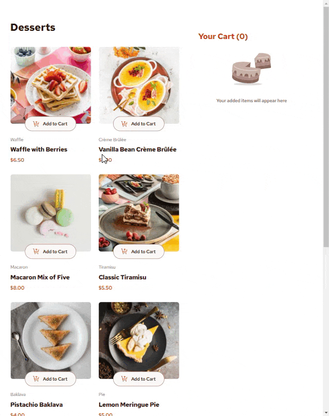

# Frontend Mentor - Job listings with filtering solution

This is a solution to the [Product list with cart challenge on Frontend Mentor](https://www.frontendmentor.io/challenges/product-list-with-cart-5MmqLVAp_d).
Frontend Mentor challenges help you improve your coding skills by building realistic projects.

## Table of contents

- [Overview](#overview)

  - [The challenge](#the-challenge)
  <!-- - [Screenshot](#screenshot) -->
  - [Links](#links)

- [Built with](#built-with)
- [Author](#author)

## Overview

### The challenge

Users should be able to:

- Add items to the cart and remove them
- Increase/decrease the number of items in the cart
- See an order confirmation modal when they click "Confirm Order"
- Reset their selections when they click "Start New Order"
- Navigate the whole project and perform all actions using only their keyboard
- View the optimal layout for the interface depending on their device's screen size
- See hover and focus states for all interactive elements on the page

<!--

### Screenshot

 -->

### Links

- Solution URL: [Code on GitHub](https://github.com/DmitryMuzalev/product-list-with-cart)
- Live Site URL: [Live on GitHub Pages](https://dmitrymuzalev.github.io/product-list-with-cart/)

## Built with

- TypeScript
- React 18.3
- Redux Toolkit
- styled-components

## Author

- Github - [DmitryMuzalev](https://github.com/DmitryMuzalev)
